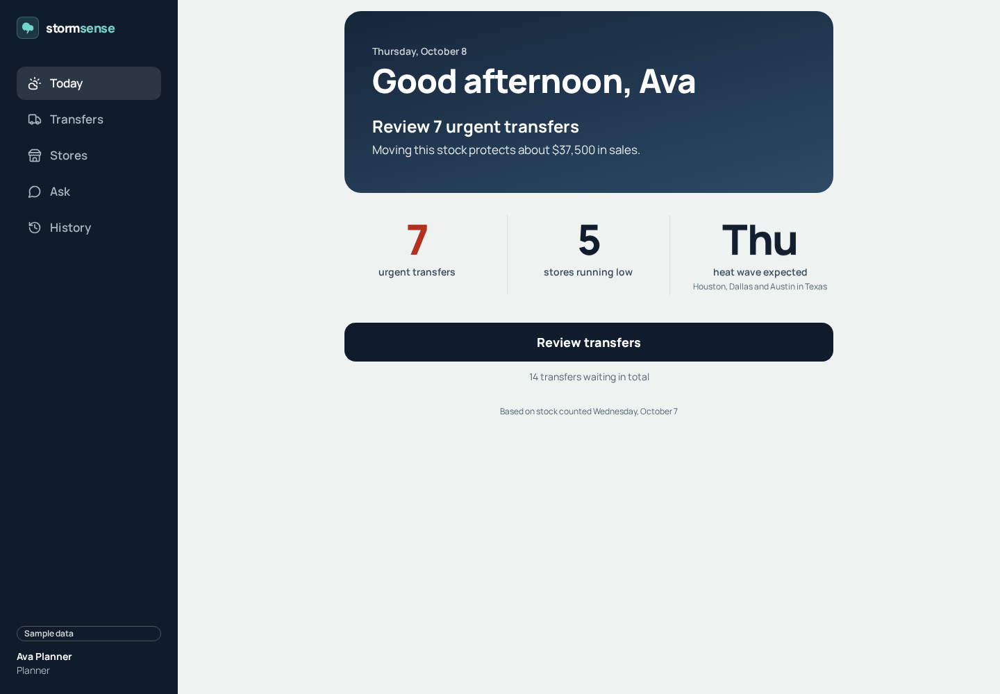
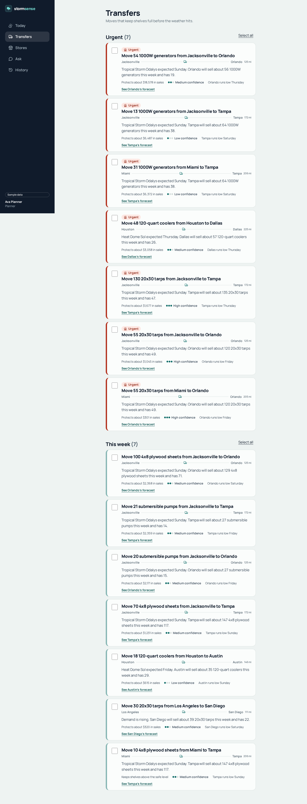
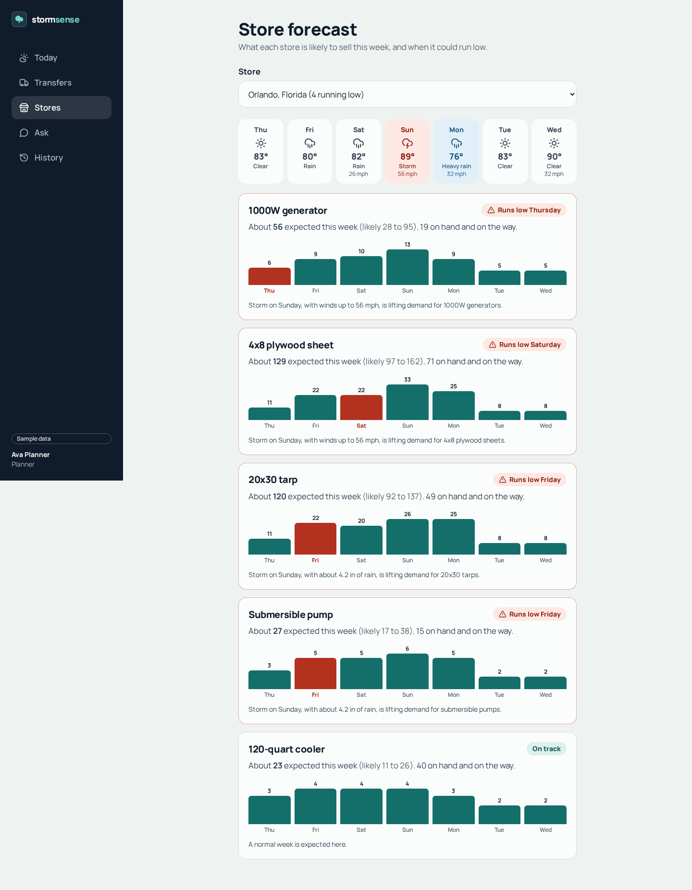
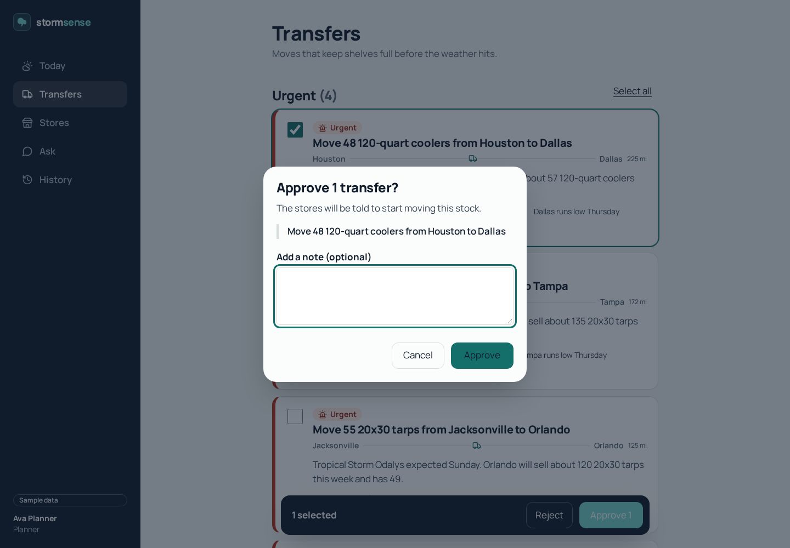
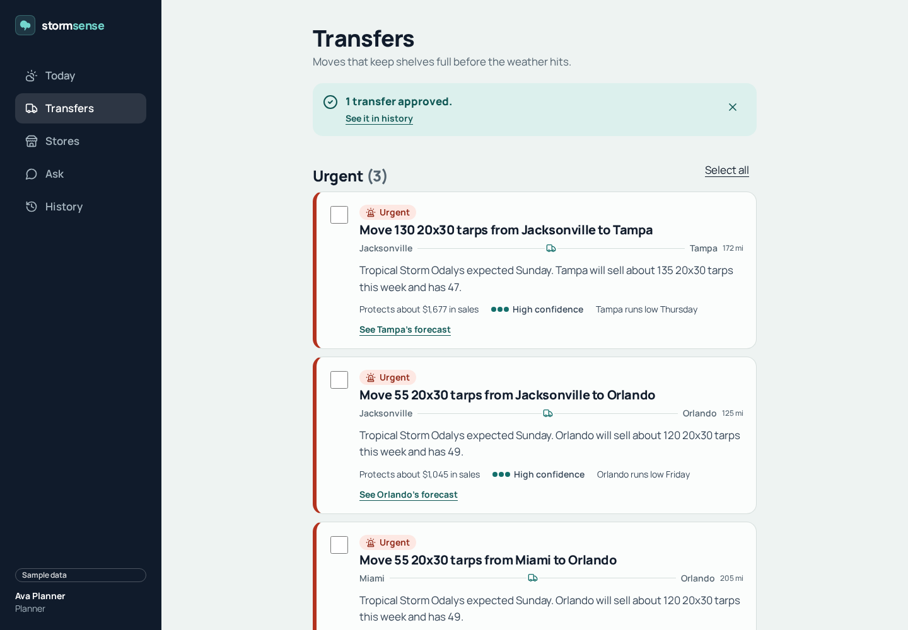
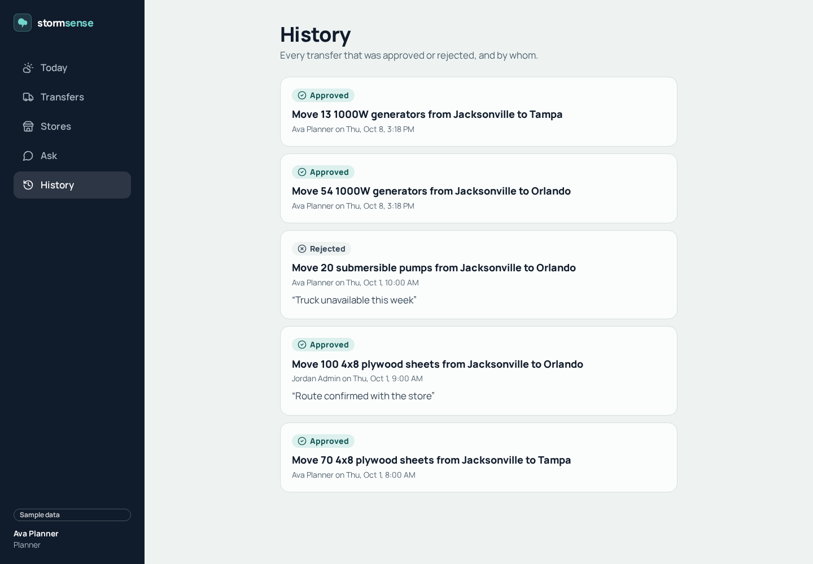
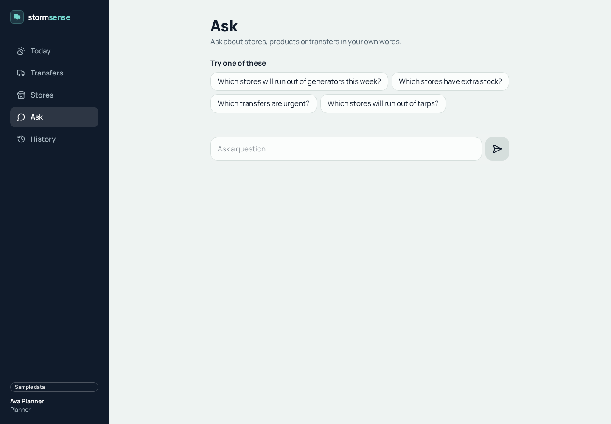
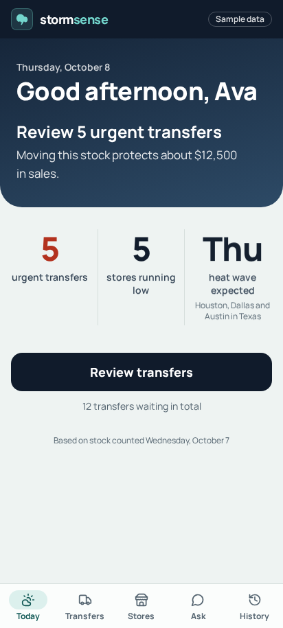
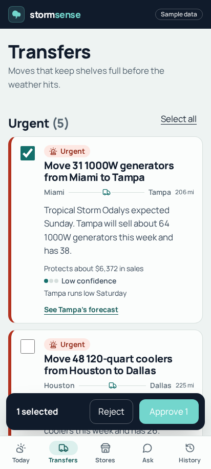

# StormSense

StormSense is a weather-aware inventory planning app for home improvement retail. It turns a seven-day weather outlook and store inventory into a clear daily plan: spot stores at risk of running low, see where surplus stock can help, and review suggested transfers before the weather hits.

The app supports the full planner workflow from a desktop or phone. The screenshots below were captured from the running frontend with the local sample-data API; they are saved in this repository under [`docs/screenshots/`](docs/screenshots/).

## Planner Workflow

1. **Start with Today.** See urgent transfers, stores at risk, the next weather alert, and a direct link to the recommended next action.

	

2. **Review transfer recommendations.** Recommendations are grouped into urgent and this-week lists. Each one explains the weather and demand behind the move, the quantity and route, estimated sales protected, confidence, the receiving store's low-stock day, and a link to its forecast.

	

3. **Check the destination forecast.** Choose a store to inspect its week of weather, expected daily product demand, expected sales range, stock on hand and on the way, and any forecast low-stock dates. Transfer links open the destination store directly.

	

4. **Make a guarded decision.** Planners can select one or many transfers. Approval asks for confirmation and accepts an optional note; rejection requires a reason. The app removes decided transfers from the pending list and reports the outcome. Viewers can inspect recommendations but cannot approve or reject them.

	

	

5. **Keep an audit trail.** History records each approved or rejected transfer, the person who decided it, when it happened, and any note or rejection reason.

	

6. **Ask a question in plain language.** The Ask page offers suggested questions and accepts questions about stores, products, and transfers. Answers can include a concise explanation and a supporting table. The screenshot shows the idle page; no Ask query was run for this README.

	

### Mobile Screens

Navigation moves to a five-item bottom bar on smaller screens, while transfer selection keeps the bulk actions within reach.

| Today | Transfers with a selection |
|---|---|
|  |  |

## Features

- **Weather-aware demand planning:** seven-day product forecasts respond to local weather and show expected units by day, a likely range, current and incoming stock, and when a product may run low.
- **Actionable transfer recommendations:** urgent and upcoming moves include route, quantity, rationale, distance, confidence, and estimated sales protected.
- **Bulk approvals and rejections:** planners can decide on multiple transfers at once, add an optional approval note, or provide a required rejection reason.
- **Role-based access:** planners can decide; viewers have read-only access. Decisions are protected by server-side checks, including when another planner has already handled a transfer.
- **Decision history:** approved and rejected recommendations remain available with actor, timestamp, and notes.
- **Plain-language Ask:** questions about stores, products, and transfers can return an answer with a supporting table.
- **Responsive and accessible UI:** desktop sidebar and mobile bottom navigation, keyboard support, visible focus, and accessible page and control labels.

## Run Locally

Requirements: Python 3.12 with [uv](https://docs.astral.sh/uv/) and Node.js 22.

```bash
make setup       # Create the Python environment and install web dependencies
make dev-sample  # Run the API and frontend using sample data
make test        # Run the Python and frontend unit tests
make e2e         # Build the app and run browser tests
```

The frontend is available at <http://localhost:5173>; the API is at <http://localhost:8000>. `make dev` uses sample data unless a local backend configuration selects a workspace. `make dev-sample` always uses fixtures, with no Databricks workspace or credits required. The fixtures are generated from the same shared planning code used by the data pipeline.

The end-to-end tests cover the approval-to-history workflow, concurrent decisions, viewer permissions, store forecasts, Ask responses, accessibility, keyboard navigation, and security headers.

## Run on Databricks

```bash
databricks auth login --host https://<your-workspace>.cloud.databricks.com --profile stormsense
make deploy
```

Deployment creates the schema and tables, trains and registers the forecaster, schedules the daily 6:00 AM job, creates the Ask space, and deploys the app from code. See the [runbook](docs/runbook.md) and [go-live checklist](docs/go-live.md).

## Repository Map

| Path | Purpose |
|---|---|
| [`frontend/`](frontend/) | React and TypeScript planner app: Today, Transfers, Stores, Ask, and History. |
| [`backend/`](backend/) | FastAPI application, identity and role checks, decision endpoints, audit history, and deployment definition. |
| [`databricks/`](databricks/) | Shared forecasting and planning code, notebooks, tables, and scheduled job resources. |
| [`infra/`](infra/) | Workspace deployment script, Docker configuration, and environment examples. |
| [`docs/`](docs/) | [System design](docs/system-design.md), [forecasting method](docs/forecasting.md), [runbook](docs/runbook.md), [verification guide](docs/how-to-verify.md), [data dictionary](docs/data-dictionary.md), and [demo script](docs/demo-script.md). |
| [`docs/screenshots/`](docs/screenshots/) | Saved product screenshots used in this README. |
| `src/`, root `index.html` | Public marketing site, separate from the planner app in `frontend/`. |

## Public Site

Three pages are published on GitHub Pages by `.github/workflows/deploy.yml`, on every push to `main`. Each one answers a different question.

### 1. Landing page: what StormSense is

<https://workatustadarshajay.github.io/STORMSENSE/>

The public-facing introduction, built from the repository-root `index.html` and `src/`. It tells the story in one scroll: a radar globe shows the weather, the next section shows how a forecast becomes a stock transfer, and a transfer approval is shown as an interaction. It ends with an ROI estimator where you can change the assumptions and see the savings move. It works on phones, follows the system's dark mode and reduced-motion settings, and is the best first stop for anyone new to the project.

### 2. Documentation website: how to use, run and maintain it

<https://workatustadarshajay.github.io/STORMSENSE/docs/>

The full documentation, built with MkDocs Material from `mkdocs.yml` and the pages in `docs/`. It has search and dark mode, and it is split by reader:

- **For planners:** the planner guide explains each screen in plain words (Today, Transfers, Stores, Ask, Storm desk, What if, History), and the five-minute demo script.
- **Getting started:** running the app on your machine, and how to check that it works.
- **How it works:** the system design, the forecasting method, and the data dictionary.
- **Integrations:** the MCP server and client, and the API reference, which is generated from the API's own OpenAPI file so it always matches the code.
- **Operations:** the runbook and the go-live checklist.

The internal change log (`what-changed.md`) is kept out of the site on purpose.

### 3. Architecture diagrams: how the system is built

<https://workatustadarshajay.github.io/STORMSENSE/architecture/>

Five interactive diagrams, built from the sources in `docs/architecture/src` and rendered with the Archify skill. They show the system from several angles: the overall system, the daily pipeline that forecasts and plans each morning, the sequence of an approval, the lifecycle of a transfer, and the deployment. Use this page when you need to see how the parts connect; use the documentation site when you need to know how to do something.

Rebuild the diagrams from `docs/architecture/src` with `make architecture`.

### Build the pages locally

The landing page:

```bash
npm ci
npm run dev
```

To build and preview it:

```bash
npm run build
npm run preview
```

The documentation website:

```bash
make docs-serve      # preview at http://127.0.0.1:8001
make docs-site       # strict build into site-build/; fails on broken links
```

For the first deployment, set **Settings > Pages** in the GitHub repository to use **GitHub Actions**. The workflow configures the repository subpath for project Pages URLs.

## License

This project is licensed under the MIT License. See [LICENSE](LICENSE).