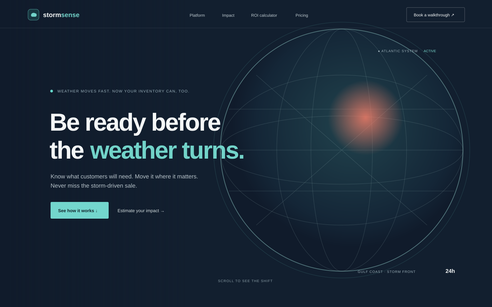

# StormSense

Weather-aware inventory planning for home improvement retail. StormSense connects local forecasts to store-level demand signals, then recommends inventory transfers while there is still time to act.

## Screen previews

The previews below show the landing page direction and its central transfer story.




## Features

- Animated Three.js radar globe in the hero
- Scroll-driven, three-step weather-to-transfer story
- Transfer approval interaction
- Interactive ROI estimate with editable assumptions
- Responsive layout, system dark mode, and reduced-motion support
- GitHub Actions deployment to GitHub Pages

## Run locally

Requirements: Node.js 20 or later and npm.

```bash
npm ci
npm run dev
```

Vite prints the local URL after the development server starts. To create and preview a production build:

```bash
npm run build
npm run preview
```

## Deploy

The workflow in `.github/workflows/deploy.yml` builds and deploys the site to GitHub Pages whenever code is pushed to `main`. It also supports a manual run from the Actions tab.

For the first deployment, open **Settings → Pages** in the GitHub repository and set the build and deployment source to **GitHub Actions**. The workflow automatically builds with the repository subpath, so project Pages URLs work without a manual Vite configuration change.

After deployment, the site is available at:

<https://workatustadarshajay.github.io/STORMSENSE/>

## Project structure

```text
.
├── .github/workflows/deploy.yml
├── docs/screenshots/       # README screen previews
├── src/main.jsx            # React page and Three.js scene
├── src/styles.css          # Responsive styles and motion
├── index.html
└── vite.config.js
```

## Technology

React 18, Vite, Three.js, React Three Fiber, GSAP ScrollTrigger, Framer Motion, and Lucide icons.

## License

This project is licensed under the MIT License. See [LICENSE](LICENSE).