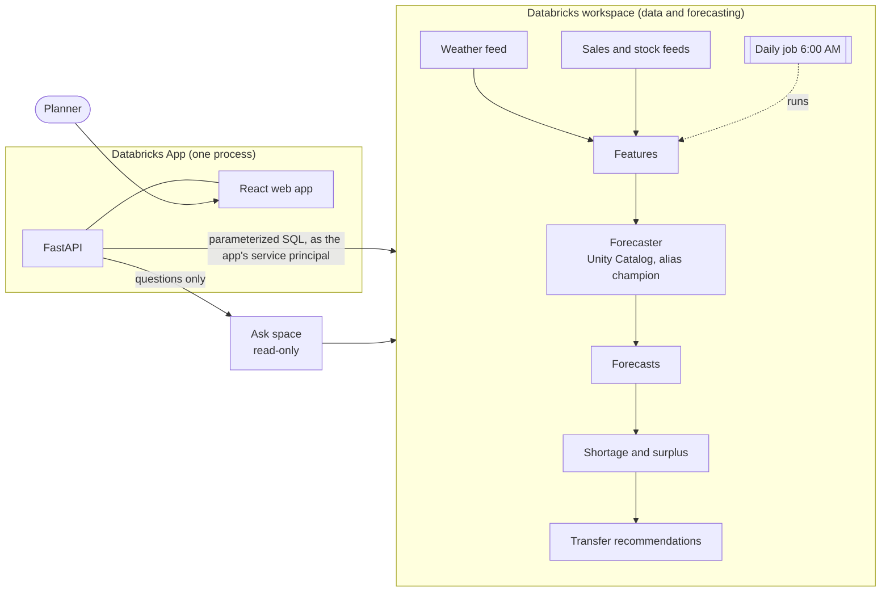

# Architecture

StormSense answers one question each morning: **given the weather coming this week, which stores will run short, which have too much, and what should move where?**

## Who does what

| Layer | Responsibility | Never |
|---|---|---|
| Databricks | Stores data in Unity Catalog tables, trains and registers the forecaster, runs the daily job, answers free-form questions in the Ask space | Is seen or logged into by planners |
| FastAPI (`backend/`) | The only thing that talks to Databricks. Sign-in identity, roles, approvals, audit trail, plain-language responses | Exposes credentials, SQL or table names to the browser |
| React (`frontend/`) | Today, Transfers, Store forecast, Ask, History | Shows technical words |

Fixed screens use constant, parameterized queries (fast, predictable, cheap). The Ask space is used only for the Ask box and can only read; approvals are always a guarded update done by the API.

## Repository

| Folder | Contents |
|---|---|
| `databricks/` | `stormsense_core` (shared, unit-tested pipeline code), numbered notebooks, the data bundle (`databricks.yml`, `resources/jobs.yml`), deploy-time scripts |
| `backend/` | FastAPI app, its tests, and the app bundle (`databricks.yml`, `app.yaml`) |
| `frontend/` | React web app, component tests and browser tests |
| `infra/` | `deploy.sh` (creates everything), Dockerfile and Compose for local container runs, `.env.example` |
| `docs/` | This documentation |
| `src/`, `index.html` | The public marketing page (separate; deployed to GitHub Pages) |

## Data flow each morning (daily job, 6:00 AM Eastern)

1. **Refresh weather** (`05_refresh_weather`): ten-day forecast per store. `sample` re-issues the sample forecast; `nws` calls the US National Weather Service and fails loudly rather than serving stale weather.
2. **Rebuild features** (`03_features`).
3. **Forecast** (`06_score`): loads the forecaster by alias `champion`, writes 7 days per store and product. Re-running a day replaces that day only.
4. **Gaps** (`07_gaps`): projected stock, days of cover, first day it runs low. Approved transfers count as stock arriving or leaving.
5. **Recommendations** (`08_recommendations`): nearest-source matching. A MERGE refreshes only PENDING rows; approved and rejected rows are never touched.
6. **Verify** (`09_verify`): fails the job loudly if anything is off.

Every task is safe to re-run and retries twice on transient failure. A failed run emails the workspace account that deployed it.

## Security model

* **Sign-in:** Databricks Apps signs people in with their workspace account and sets `X-Forwarded-Email`; the app is reachable only through that proxy. Roles (`viewer`, `planner`, `admin`) live in the `app_users` table; unknown workspace users are read-only viewers. Only planners and admins can approve or reject.
* **Service principal:** the app runs as its own service principal, created by the platform, with read access to the tables and write access to `transfer_recommendations` and `transfer_audit` only. No personal tokens, no secrets in code or the browser.
* **SQL:** every statement is a constant string with bound parameters. A test proves user input never reaches statement text, and a static test fails the build if request data is ever interpolated.
* **Approvals:** `UPDATE ... WHERE status = 'PENDING'` stamps the request id on the rows it changes, so the response lists exactly what this request changed and what was already handled. Every change, and every skipped attempt, is written to `transfer_audit`.
* **Browser:** strict content security policy, no framing, same-origin only (no CORS at all), a custom header required on every state-changing request, request size limit, per-person rate limit on Ask.
* **Ask:** returns one sentence and a table; SQL is never shown and nothing Ask returns is executed by the app.

## Decisions worth knowing

* **Workspace sign-in instead of email and password.** Hosting as a Databricks App gives single sign-on, roles and an audit identity without a password store. Mock mode keeps a local dev identity so the app runs anywhere.
* **Gradient-boosted regression from scikit-learn** (`HistGradientBoostingRegressor`, Poisson loss) rather than LightGBM: same model family, already present on serverless compute, one fewer dependency. AutoML is not used because it is being deprecated.
* **Pandas on the driver.** The daily cycle covers 50 store-product pairs; the logic is plain pandas that is easy to test. Move to Spark SQL if the store count grows into the thousands.
* **Two bundles.** `databricks/` (data) is deployed first; the Ask space is created over the tables; then `backend/` (app) is deployed with the space and warehouse ids. This avoids a chicken-and-egg between the space and the app.
* **Sample data is labelled.** The app shows a small "Sample data" label, driven by the `data_label` setting, until real feeds replace the sample tables.
