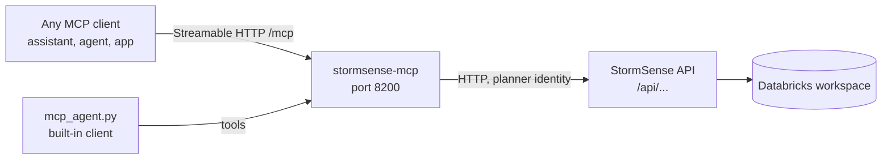

# MCP server and client

StormSense can be connected to anything that speaks the [Model Context Protocol](https://modelcontextprotocol.io). An AI assistant, an agent framework or an existing app can read the storm plan, ask questions, run a what-if, and approve or reject moves. Every call goes through the StormSense API, so the same roles, rate limits and audit trail apply.



## Tools

| Tool | Kind | What it does |
|---|---|---|
| `stormsense_overview` | read | Urgent moves, moves waiting, stores at risk, next weather alert |
| `stormsense_list_transfers` | read | Moves filtered by status and urgency (defaults to pending) |
| `stormsense_get_transfer` | read | One move by its id, with its reason |
| `stormsense_list_stores` | read | Stores in the network |
| `stormsense_store_forecast` | read | A store's seven-day forecast |
| `stormsense_ask` | read | A plain-language question, answered from the data |
| `stormsense_what_if` | read | Storm cost estimate. Changes nothing |
| `stormsense_storm_desk_plan` | read | The storm desk plan. Takes about a minute. Approves nothing |
| `stormsense_approve_transfers` | write | Approves pending moves. The API checks the account's role |
| `stormsense_reject_transfers` | write | Rejects pending moves with a reason |

Inputs are checked before any call. Transfer ids must look like `TR-XXXXXXXXXX` and store ids like `S01`. Errors come back as plain messages, for example when an account is not allowed to approve.

## Run it

```bash
# 1. The StormSense API (see running-locally.md)
cd backend && ../.venv/bin/python -m uvicorn app.main:create_default_app --factory --port 8000

# 2. The MCP server
cd stormsense-mcp
STORMSENSE_API_URL=http://localhost:8000/api uv run --system-certs uvicorn server:app --port 8200
```

The MCP endpoint is `http://localhost:8200/mcp`. The health check is at `/health`.

## Connect a client

The demo client needs no extra packages. It lists the tools, reads the overview and transfers, runs a what-if, and can approve one move:

```bash
cd stormsense-mcp
uv run python demo_client.py                 # read-only
uv run python demo_client.py --approve       # also changes data
```

The built-in agent asks a workspace chat model which tools to use and answers in plain words:

```bash
uv run python mcp_agent.py "Which stores are at risk today?"
```

It is read-only unless `ALLOW_WRITES=1` is set.

## Security

- The server holds no data and no credentials. It acts as the planner account named in `STORMSENSE_MCP_USER`.
- The API trusts that identity only behind its sign-in proxy. Run the server inside the same trusted network as the app. Do not expose it publicly with a planner identity.
- Approvals and rejections are recorded in the audit trail with the account that made them.

## Tests

```bash
cd stormsense-mcp
uv run --group dev pytest -q     # six tests against a stand-in API; no network needed
```
